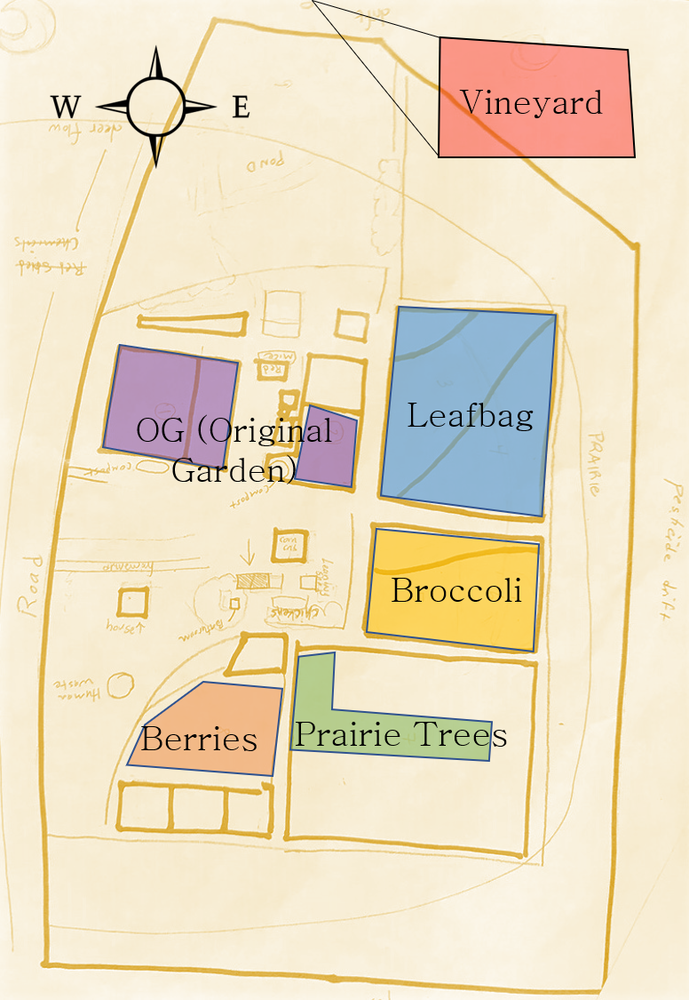

```{r, include = FALSE}
knitr::opts_chunk$set(
  collapse = TRUE,
  comment = "#>",
  #fig.path = "pics",
  out.width = "100%"
)
```

# Mustard Seed Community Farm 

Data and analysis for *Mustard Seed Farm* March 2020 soil measurements are stored here! Data were taken with the help of **Clara** and **Cece**, pictured below in the broccoli field, and **Alice**, **Usman**, and **myself** (Gina). 

# Soil Tests
We soil sampled each field and sent it off for nutrient analyses. **Alice** is in charge of those results. Maybe they'll go here someday.

# Penetrometer Measurements 
We took readings on how hard the soil was to penetrate across 0-40cm depths. Readings were taken at various points in each field. 

[A shiny app is available](https://vanichols.shinyapps.io/MustardSeedPenetrometer/) to explore the penetrometer data. 


